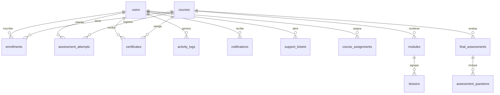

# Database Schema Plan — EdTech Platform

> Fase v1.16 — Diseño de arquitectura de datos para futura migración a Supabase/PostgreSQL.
> Este documento NO implementa conexión a base de datos. Es únicamente un plan de arquitectura.

---

## 1. Propuesta de tablas futuras

### `users`

Almacena la información de todos los usuarios de la plataforma (colaboradores y administradores).

| Campo | Tipo | Restricciones | Descripción |
|---|---|---|---|
| `id` | `uuid` | `PRIMARY KEY DEFAULT gen_random_uuid()` | Identificador único |
| `name` | `varchar(255)` | `NOT NULL` | Nombre completo |
| `email` | `varchar(255)` | `NOT NULL UNIQUE` | Correo electrónico |
| `password_hash` | `varchar(255)` | `NOT NULL` | Hash de contraseña (Supabase Auth) |
| `role` | `varchar(20)` | `NOT NULL DEFAULT 'collaborator' CHECK (role IN ('collaborator', 'admin'))` | Rol del usuario |
| `position` | `varchar(255)` | | Cargo dentro de la empresa |
| `department` | `varchar(255)` | | Departamento |
| `active` | `boolean` | `NOT NULL DEFAULT true` | Estado de la cuenta |
| `created_at` | `timestamptz` | `NOT NULL DEFAULT now()` | Fecha de registro |

**Nota:** En Supabase, `password_hash` puede manejarse directamente con `auth.users` y referenciarse mediante `id` (UUID sincronizado).

---

### `courses`

Catálogo de cursos disponibles en la plataforma.

| Campo | Tipo | Restricciones | Descripción |
|---|---|---|---|
| `id` | `uuid` | `PRIMARY KEY DEFAULT gen_random_uuid()` | Identificador único |
| `title` | `varchar(255)` | `NOT NULL` | Título del curso |
| `description` | `text` | | Descripción del curso |
| `category` | `varchar(100)` | `NOT NULL` | Categoría (Gestión, Tecnología, etc.) |
| `level` | `varchar(20)` | `NOT NULL CHECK (level IN ('Básico', 'Intermedio', 'Avanzado'))` | Nivel de dificultad |
| `duration` | `varchar(50)` | | Duración estimada (ej. "4 horas") |
| `thumbnail` | `text` | | URL de la imagen del curso |
| `status` | `varchar(20)` | `NOT NULL DEFAULT 'active' CHECK (status IN ('active', 'inactive'))` | Estado del curso |
| `created_at` | `timestamptz` | `NOT NULL DEFAULT now()` | Fecha de creación |

---

### `modules`

Agrupación de lecciones dentro de un curso. Relación 1:N con courses.

| Campo | Tipo | Restricciones | Descripción |
|---|---|---|---|
| `id` | `uuid` | `PRIMARY KEY DEFAULT gen_random_uuid()` | Identificador único |
| `course_id` | `uuid` | `NOT NULL REFERENCES courses(id) ON DELETE CASCADE` | Curso al que pertenece |
| `title` | `varchar(255)` | `NOT NULL` | Título del módulo |
| `description` | `text` | | Descripción breve del módulo |
| `order` | `integer` | `NOT NULL DEFAULT 0` | Orden de visualización |

---

### `lessons`

Unidad mínima de contenido. Relación 1:N con modules.

| Campo | Tipo | Restricciones | Descripción |
|---|---|---|---|
| `id` | `uuid` | `PRIMARY KEY DEFAULT gen_random_uuid()` | Identificador único |
| `module_id` | `uuid` | `NOT NULL REFERENCES modules(id) ON DELETE CASCADE` | Módulo al que pertenece |
| `title` | `varchar(255)` | `NOT NULL` | Título de la lección |
| `description` | `text` | | Descripción del contenido de la lección |
| `video_url` | `text` | | URL del video (embed YouTube o Supabase Storage) |
| `duration` | `varchar(50)` | | Duración estimada de la lección |
| `order` | `integer` | `NOT NULL DEFAULT 0` | Orden de visualización |

---

### `enrollments`

Registro de inscripción de un usuario a un curso con seguimiento de progreso.

| Campo | Tipo | Restricciones | Descripción |
|---|---|---|---|
| `id` | `uuid` | `PRIMARY KEY DEFAULT gen_random_uuid()` | Identificador único |
| `user_id` | `uuid` | `NOT NULL REFERENCES users(id) ON DELETE CASCADE` | Usuario inscrito |
| `course_id` | `uuid` | `NOT NULL REFERENCES courses(id) ON DELETE CASCADE` | Curso asignado |
| `progress` | `integer` | `NOT NULL DEFAULT 0 CHECK (progress >= 0 AND progress <= 100)` | Porcentaje de avance |
| `completed_lessons` | `uuid[]` | `NOT NULL DEFAULT '{}'` | Array de IDs de lecciones completadas |
| `course_completed` | `boolean` | `NOT NULL DEFAULT false` | Indica si el curso fue completado |
| `assigned_at` | `timestamptz` | `NOT NULL DEFAULT now()` | Fecha de asignación |

**UNIQUE CONSTRAINT:** `(user_id, course_id)` — un usuario no puede tener dos inscripciones al mismo curso.

---

### `assessment_attempts`

Intentos de evaluación final por usuario y curso.

| Campo | Tipo | Restricciones | Descripción |
|---|---|---|---|
| `id` | `uuid` | `PRIMARY KEY DEFAULT gen_random_uuid()` | Identificador único |
| `user_id` | `uuid` | `NOT NULL REFERENCES users(id) ON DELETE CASCADE` | Usuario que intentó |
| `course_id` | `uuid` | `NOT NULL REFERENCES courses(id) ON DELETE CASCADE` | Curso evaluado |
| `score` | `integer` | `NOT NULL CHECK (score >= 0 AND score <= 100)` | Calificación obtenida |
| `approved` | `boolean` | `NOT NULL` | Indica si aprobó |
| `attempted_at` | `timestamptz` | `NOT NULL DEFAULT now()` | Fecha del intento |

---

### `certificates`

Certificados emitidos al aprobar un curso.

| Campo | Tipo | Restricciones | Descripción |
|---|---|---|---|
| `id` | `uuid` | `PRIMARY KEY DEFAULT gen_random_uuid()` | Identificador único |
| `user_id` | `uuid` | `NOT NULL REFERENCES users(id) ON DELETE CASCADE` | Usuario que recibe el certificado |
| `course_id` | `uuid` | `NOT NULL REFERENCES courses(id) ON DELETE CASCADE` | Curso completado |
| `issued_at` | `timestamptz` | `NOT NULL DEFAULT now()` | Fecha de emisión |
| `certificate_url` | `text` | | URL del PDF del certificado (Supabase Storage) |

**UNIQUE CONSTRAINT:** `(user_id, course_id)` — un solo certificado por usuario y curso.

---

### `activity_logs`

Registro de auditoría del sistema.

| Campo | Tipo | Restricciones | Descripción |
|---|---|---|---|
| `id` | `uuid` | `PRIMARY KEY DEFAULT gen_random_uuid()` | Identificador único |
| `user_id` | `uuid` | `REFERENCES users(id) ON DELETE SET NULL` | Usuario que realizó la acción (nullable para acciones del sistema) |
| `action` | `varchar(50)` | `NOT NULL` | Tipo de acción (user_created, course_assigned, etc.) |
| `description` | `text` | `NOT NULL` | Descripción legible de la acción |
| `created_at` | `timestamptz` | `NOT NULL DEFAULT now()` | Fecha del evento |

---

### Tablas secundarias (futuras)

Las siguientes tablas también existen conceptualmente en la aplicación actual y deberían migrarse:

#### `final_assessments`

Evaluaciones finales asociadas a un curso.

| Campo | Tipo |
|---|---|
| `id` | `uuid PK` |
| `course_id` | `uuid FK → courses(id) ON DELETE CASCADE` |
| `passing_percentage` | `integer NOT NULL DEFAULT 70` |
| `created_at` | `timestamptz` |
| `updated_at` | `timestamptz` |

#### `assessment_questions`

Preguntas individuales de una evaluación. Relación 1:N con final_assessments.

| Campo | Tipo |
|---|---|
| `id` | `uuid PK` |
| `assessment_id` | `uuid FK → final_assessments(id) ON DELETE CASCADE` |
| `question` | `text NOT NULL` |
| `options` | `text[] NOT NULL` |
| `correct_answer_index` | `integer NOT NULL` |
| `order` | `integer NOT NULL DEFAULT 0` |

#### `notifications`

Notificaciones dirigidas a usuarios.

| Campo | Tipo |
|---|---|
| `id` | `uuid PK` |
| `user_id` | `uuid FK → users(id) ON DELETE CASCADE` |
| `type` | `varchar(20) NOT NULL` |
| `title` | `varchar(255) NOT NULL` |
| `message` | `text NOT NULL` |
| `read` | `boolean NOT NULL DEFAULT false` |
| `created_at` | `timestamptz` |

#### `support_tickets`

Tickets de soporte técnico.

| Campo | Tipo |
|---|---|
| `id` | `uuid PK` |
| `user_id` | `uuid FK → users(id) ON DELETE CASCADE` |
| `subject` | `varchar(255) NOT NULL` |
| `description` | `text NOT NULL` |
| `priority` | `varchar(10) NOT NULL` |
| `status` | `varchar(20) NOT NULL` |
| `created_at` | `timestamptz` |

---

## 2. Relaciones entre tablas

```
users (1) ──────< (N) enrollments
users (1) ──────< (N) assessment_attempts
users (1) ──────< (N) certificates
users (1) ──────< (N) activity_logs
users (1) ──────< (N) notifications
users (1) ──────< (N) support_tickets
users (1) ──────< (N) course_assignments (mergeable con enrollments)

courses (1) ──────< (N) modules
courses (1) ──────< (N) enrollments
courses (1) ──────< (N) certificates
courses (1) ──────< (N) final_assessments
courses (1) ──────< (N) assessment_attempts

modules (1) ──────< (N) lessons

final_assessments (1) ──────< (N) assessment_questions
```

### Mermaid diagram



---

## 3. Comparación: modelos actuales vs. futuras tablas

### `User` vs `users`

| Campo actual `types.ts` | Tabla futura | Estado |
|---|---|---|
| `id: string` | `id uuid` | Existe — cambiar de string a uuid |
| `name: string` | `name` | Existe |
| `email: string` | `email` | Existe |
| `password?: string` | `password_hash` | **Modificar** — almacenar hash, no texto plano |
| `role: 'collaborator' \| 'admin'` | `role` | Existe |
| `position?: string` | `position` | Existe (opcional) |
| `department?: string` | `department` | Existe (opcional) |
| `active?: boolean` | `active` | Existe (opcional → pasar a requerido con default) |
| `createdAt?: Date` | `created_at` | Existe — normalizar a snake_case |
| *(no existe)* | `auth_id` (Supabase Auth UID) | **Agregar** — referencia al Auth de Supabase |

### `Course` vs `courses`

| Campo actual `types.ts` | Tabla futura | Estado |
|---|---|---|
| `id: string` | `id uuid` | Existe |
| `title: string` | `title` | Existe |
| `description: string` | `description` | Existe |
| `category: string` | `category` | Existe |
| `level: CourseLevel` | `level` | Existe |
| `duration: string` | `duration` | Existe |
| `status: CourseStatus` | `status` | Existe |
| `thumbnail: string` | `thumbnail` | Existe |
| `modules: Module[]` | *(relación separada)* | **Modificar** — pasar a tabla separada |
| `learningObjectives: string[]` | *(no existe)* | **Eliminar o migrar** — podría ser columna text[] adicional o eliminarse |

### `Module` vs `modules`

| Campo actual `types.ts` | Tabla futura | Estado |
|---|---|---|
| `id: string` | `id uuid` | Existe |
| *(no existe)* | `course_id` | **Agregar** — FK al curso |
| `title: string` | `title` | Existe |
| `description?: string` | `description` | Existe (opcional) |
| `orderIndex: number` | `order` | Existe — renombrar |
| `lessons: Lesson[]` | *(relación separada)* | **Modificar** — pasar a tabla separada |

### `Lesson` vs `lessons`

| Campo actual `types.ts` | Tabla futura | Estado |
|---|---|---|
| `id: string` | `id uuid` | Existe |
| *(no existe)* | `module_id` | **Agregar** — FK al módulo |
| `title: string` | `title` | Existe |
| `description?: string` | `description` | Existe (agregado en v1.15) |
| `videoUrl?: string` | `video_url` | Existe — normalizar a snake_case |
| `duration: string` | `duration` | Existe |
| *(no existe)* | `order` | **Agregar** — orden de lección |

### `UserEnrollment` vs `enrollments`

| Campo actual `types.ts` | Tabla futura | Estado |
|---|---|---|
| `id: string` | `id uuid` | Existe |
| `userId: string` | `user_id` | Existe — normalizar a snake_case |
| `courseId: string` | `course_id` | Existe — normalizar a snake_case |
| `progress: number` | `progress` | Existe |
| `completedLessons: string[]` | `completed_lessons` | Existe — cambiar a `uuid[]` |
| `enrolledAt: Date` | `assigned_at` | Existe — renombrar |
| `courseCompleted?: boolean` | `course_completed` | Existe — pasar a requerido con default false |

### `Certificate` vs `certificates`

| Campo actual `types.ts` | Tabla futura | Estado |
|---|---|---|
| `id: string` | `id uuid` | Existe |
| `userId: string` | `user_id` | Existe — normalizar |
| `courseId: string` | `course_id` | Existe — normalizar |
| `issueDate: Date` | `issued_at` | Existe — renombrar |
| `certificateNumber: string` | *(eliminar)* | **Eliminar** — reemplazar por `certificate_url` |
| *(no existe)* | `certificate_url` | **Agregar** — URL del PDF generado |

### `ActivityLog` vs `activity_logs`

| Campo actual `types.ts` | Tabla futura | Estado |
|---|---|---|
| `id: string` | `id uuid` | Existe |
| `userId: string \| null` | `user_id` | Existe — normalizar |
| `action: ActivityAction` | `action` | Existe |
| `description: string` | `description` | Existe |
| `createdAt: Date` | `created_at` | Existe — normalizar |

### `UserAssessmentAttempt` vs `assessment_attempts`

| Campo actual `types.ts` | Tabla futura | Estado |
|---|---|---|
| `id: string` | `id uuid` | Existe |
| `userId: string` | `user_id` | Existe — normalizar |
| `courseId: string` | `course_id` | Existe — normalizar |
| `answers: number[]` | *(opcional)* | **Evaluar** — puede omitirse en DB por privacidad |
| `score: number` | `score` | Existe |
| `passed: boolean` | `approved` | Existe — renombrar |
| `attemptedAt: Date` | `attempted_at` | Existe — normalizar |

---

## 4. Análisis de videos

### Estado actual

El campo `Lesson.videoUrl` funciona como una referencia URL directa. Actualmente se usa para:

- **YouTube embeds**: URLs de YouTube insertadas manualmente por el administrador
- **Placeholder**: Si no hay URL, se muestra contenido de lectura sin video

### Implementación futura

En una migración a Supabase Storage:

```
Supabase Storage Bucket: course-videos
  /{courseId}/
    {moduleId}/
      {lessonId}.mp4
```

**Flujo propuesto:**

1. Administrador sube video desde el panel de gestión de lecciones
2. Supabase Storage genera una URL pública firmada o pública
3. Esa URL se almacena en `lessons.video_url`
4. El reproductor en VirtualClassroom la consume vía iframe o `<video>` tag

**Consideraciones:**

- YouTube embeds seguirán funcionando como `video_url` alternativa
- Para videos subidos directamente, usar `<video>` nativo con source del bucket
- Supabase Storage permite establecer políticas RLS para controlar acceso
- Los thumbnails de cursos (`Course.thumbnail`) también pueden migrarse a Storage

---

## 5. Mapeo de servicios a tablas futuras

| Servicio (v1.14) | Tabla destino | Función actual → Futura |
|---|---|---|
| `userService.getUsers()` | `users` | `SELECT * FROM users` |
| `userService.createUser()` | `users` | `INSERT INTO users ...` |
| `userService.updateUser()` | `users` | `UPDATE users SET ... WHERE id = ...` |
| `userService.deleteUser()` | `users` | `UPDATE users SET active = false` (borrado lógico) |
| `courseService.getCourses()` | `courses` | `SELECT * FROM courses` |
| `courseService.createCourse()` | `courses` | `INSERT INTO courses ...` |
| `courseService.updateCourse()` | `courses` | `UPDATE courses SET ... WHERE id = ...` |
| `courseService.deleteCourse()` | `courses` | `UPDATE courses SET status = 'inactive'` (borrado lógico) |
| `enrollmentService.getEnrollments()` | `enrollments` | `SELECT * FROM enrollments` |
| `enrollmentService.assignCourse()` | `enrollments` | `INSERT INTO enrollments ...` |
| `enrollmentService.unassignCourse()` | `enrollments` | `DELETE FROM enrollments WHERE ...` |
| `enrollmentService.updateEnrollment()` | `enrollments` | `UPDATE enrollments SET ... WHERE id = ...` |
| `certificateService.getCertificates()` | `certificates` | `SELECT * FROM certificates` |
| `certificateService.createCertificate()` | `certificates` | `INSERT INTO certificates ...` |
| `activityService.getActivityLogs()` | `activity_logs` | `SELECT * FROM activity_logs ORDER BY created_at DESC` |
| `activityService.createActivityLog()` | `activity_logs` | `INSERT INTO activity_logs ...` |

### Estrategia de migración de servicios

Cada servicio mantiene su interfaz actual (funciones que retornan `Promise`). El cambio será interno:

```typescript
// Antes (mock)
export function getUsers(): Promise<User[]> {
  return Promise.resolve([...usersData]);
}

// Después (Supabase)
export function getUsers(): Promise<User[]> {
  const { data } = await supabase.from('users').select('*');
  return data as User[];
}
```

---

## 6. Resumen de cambios necesarios para migración

### Antes de migrar (preparación)

1. **Estandarizar nomenclatura**: Cambiar camelCase de TypeScript (`createdAt`, `userId`, etc.) a snake_case de SQL (`created_at`, `user_id`)
2. **IDs UUID**: Migrar de strings numéricos (`'1'`, `'2'`) a UUIDs. Los servicios actuales ya generan IDs tipo `user_${Date.now()}` — deben migrar a `crypto.randomUUID()` o delegar a la DB
3. **Campos opcionales → requeridos**: `active`, `courseCompleted` y similares deben tener valores por defecto explícitos
4. **Separar módulos y lecciones**: Actualmente están anidados dentro de `Course.modules[]` y `Module.lessons[]`. En DB serán tablas separadas con FK

### Durante la migración

1. **Crear tablas** con el esquema propuesto (usando migraciones de Supabase)
2. **Poblar datos** desde los mocks actuales en scripts de seed
3. **Reemplazar implementaciones** de servicios para usar `supabase-js` en lugar de datos en memoria
4. **Configurar RLS** (Row Level Security) para controlar acceso según rol
5. **Configurar Storage** para thumbnails, videos y certificados PDF

### Después de migrar

1. **Eliminar archivos mock**: `src/data/mockData.ts` y `src/data/extendedMockData.ts` (una vez verificada la migración)
2. **Eliminar estado local en App.tsx**: Reemplazar `useState` con consultas a servicios
3. **Añadir autenticación real** con Supabase Auth (reemplazar Login actual)
4. **Añadir React Query o SWR** para manejo de caché y estado de servidor

---

## 7. SQL de creación (PostgreSQL)

```sql
-- Extensión para UUIDs
CREATE EXTENSION IF NOT EXISTS "uuid-ossp";

-- ============================================================
-- TABLAS PRINCIPALES
-- ============================================================

CREATE TABLE users (
  id          uuid PRIMARY KEY DEFAULT uuid_generate_v4(),
  name        varchar(255) NOT NULL,
  email       varchar(255) NOT NULL UNIQUE,
  password_hash varchar(255) NOT NULL,
  role        varchar(20) NOT NULL DEFAULT 'collaborator'
              CHECK (role IN ('collaborator', 'admin')),
  position    varchar(255),
  department  varchar(255),
  active      boolean NOT NULL DEFAULT true,
  created_at  timestamptz NOT NULL DEFAULT now()
);

CREATE TABLE courses (
  id          uuid PRIMARY KEY DEFAULT uuid_generate_v4(),
  title       varchar(255) NOT NULL,
  description text,
  category    varchar(100) NOT NULL,
  level       varchar(20) NOT NULL
              CHECK (level IN ('Básico', 'Intermedio', 'Avanzado')),
  duration    varchar(50),
  thumbnail   text,
  status      varchar(20) NOT NULL DEFAULT 'active'
              CHECK (status IN ('active', 'inactive')),
  created_at  timestamptz NOT NULL DEFAULT now()
);

CREATE TABLE modules (
  id          uuid PRIMARY KEY DEFAULT uuid_generate_v4(),
  course_id   uuid NOT NULL REFERENCES courses(id) ON DELETE CASCADE,
  title       varchar(255) NOT NULL,
  description text,
  "order"     integer NOT NULL DEFAULT 0
);
CREATE INDEX idx_modules_course_id ON modules(course_id);

CREATE TABLE lessons (
  id          uuid PRIMARY KEY DEFAULT uuid_generate_v4(),
  module_id   uuid NOT NULL REFERENCES modules(id) ON DELETE CASCADE,
  title       varchar(255) NOT NULL,
  description text,
  video_url   text,
  duration    varchar(50),
  "order"     integer NOT NULL DEFAULT 0
);
CREATE INDEX idx_lessons_module_id ON lessons(module_id);

CREATE TABLE enrollments (
  id                uuid PRIMARY KEY DEFAULT uuid_generate_v4(),
  user_id           uuid NOT NULL REFERENCES users(id) ON DELETE CASCADE,
  course_id         uuid NOT NULL REFERENCES courses(id) ON DELETE CASCADE,
  progress          integer NOT NULL DEFAULT 0
                    CHECK (progress >= 0 AND progress <= 100),
  completed_lessons uuid[] NOT NULL DEFAULT '{}',
  course_completed  boolean NOT NULL DEFAULT false,
  assigned_at       timestamptz NOT NULL DEFAULT now(),
  UNIQUE (user_id, course_id)
);
CREATE INDEX idx_enrollments_user_id ON enrollments(user_id);
CREATE INDEX idx_enrollments_course_id ON enrollments(course_id);

CREATE TABLE assessment_attempts (
  id            uuid PRIMARY KEY DEFAULT uuid_generate_v4(),
  user_id       uuid NOT NULL REFERENCES users(id) ON DELETE CASCADE,
  course_id     uuid NOT NULL REFERENCES courses(id) ON DELETE CASCADE,
  score         integer NOT NULL CHECK (score >= 0 AND score <= 100),
  approved      boolean NOT NULL,
  attempted_at  timestamptz NOT NULL DEFAULT now()
);
CREATE INDEX idx_assessment_attempts_user_id ON assessment_attempts(user_id);

CREATE TABLE certificates (
  id               uuid PRIMARY KEY DEFAULT uuid_generate_v4(),
  user_id          uuid NOT NULL REFERENCES users(id) ON DELETE CASCADE,
  course_id        uuid NOT NULL REFERENCES courses(id) ON DELETE CASCADE,
  issued_at        timestamptz NOT NULL DEFAULT now(),
  certificate_url  text,
  UNIQUE (user_id, course_id)
);

CREATE TABLE activity_logs (
  id          uuid PRIMARY KEY DEFAULT uuid_generate_v4(),
  user_id     uuid REFERENCES users(id) ON DELETE SET NULL,
  action      varchar(50) NOT NULL,
  description text NOT NULL,
  created_at  timestamptz NOT NULL DEFAULT now()
);
CREATE INDEX idx_activity_logs_user_id ON activity_logs(user_id);
CREATE INDEX idx_activity_logs_created_at ON activity_logs(created_at DESC);

-- ============================================================
-- TABLAS SECUNDARIAS
-- ============================================================

CREATE TABLE final_assessments (
  id                 uuid PRIMARY KEY DEFAULT uuid_generate_v4(),
  course_id          uuid NOT NULL REFERENCES courses(id) ON DELETE CASCADE,
  passing_percentage integer NOT NULL DEFAULT 70,
  created_at         timestamptz NOT NULL DEFAULT now(),
  updated_at         timestamptz NOT NULL DEFAULT now()
);
CREATE INDEX idx_final_assessments_course_id ON final_assessments(course_id);

CREATE TABLE assessment_questions (
  id                   uuid PRIMARY KEY DEFAULT uuid_generate_v4(),
  assessment_id        uuid NOT NULL REFERENCES final_assessments(id) ON DELETE CASCADE,
  question             text NOT NULL,
  options              text[] NOT NULL,
  correct_answer_index integer NOT NULL,
  "order"              integer NOT NULL DEFAULT 0
);
CREATE INDEX idx_assessment_questions_assessment_id ON assessment_questions(assessment_id);

CREATE TABLE notifications (
  id         uuid PRIMARY KEY DEFAULT uuid_generate_v4(),
  user_id    uuid NOT NULL REFERENCES users(id) ON DELETE CASCADE,
  type       varchar(20) NOT NULL,
  title      varchar(255) NOT NULL,
  message    text NOT NULL,
  read       boolean NOT NULL DEFAULT false,
  created_at timestamptz NOT NULL DEFAULT now()
);
CREATE INDEX idx_notifications_user_id ON notifications(user_id);

CREATE TABLE support_tickets (
  id          uuid PRIMARY KEY DEFAULT uuid_generate_v4(),
  user_id     uuid NOT NULL REFERENCES users(id) ON DELETE CASCADE,
  subject     varchar(255) NOT NULL,
  description text NOT NULL,
  priority    varchar(10) NOT NULL CHECK (priority IN ('low', 'medium', 'high')),
  status      varchar(20) NOT NULL DEFAULT 'open'
              CHECK (status IN ('open', 'in_progress', 'resolved', 'closed')),
  created_at  timestamptz NOT NULL DEFAULT now()
);
CREATE INDEX idx_support_tickets_user_id ON support_tickets(user_id);
```

---

## 8. Recomendaciones para la migración a Supabase

### Prioridad alta

1. **Migrar autenticación primero**: Supabase Auth debe ser el primer paso para que `users.id` se sincronice con `auth.users`
2. **Configurar RLS desde el día 1**: Cada tabla debe tener políticas que restrinjan acceso según rol
3. **Usar migraciones versionadas**: Cada cambio de esquema debe ser una migración SQL en `supabase/migrations/`

### Prioridad media

4. **Adoptar tipos generados**: Usar `supabase gen types` para generar tipos TypeScript desde el esquema SQL
5. **Implementar Soft Deletes**: Usar `deleted_at` en lugar de DELETE físico para auditoría
6. **Sustituir mock data gradualmente**: Un servicio a la vez, empezando por `userService` y `courseService`

### Prioridad baja

7. **React Query / SWR**: Para manejar caché y sincronización con el servidor
8. **Subida de videos**: Implementar después de tener Storage configurado y políticas RLS de acceso
9. **Certificados en PDF**: Usar Supabase Storage + Edge Functions para generación server-side

---

*Documento generado en v1.16 — Database Schema Design*
